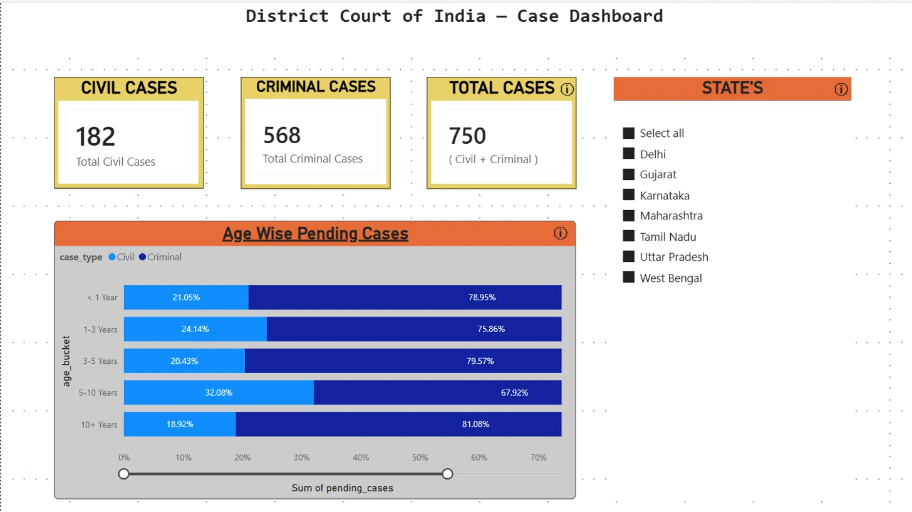
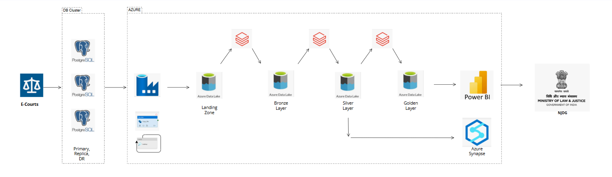
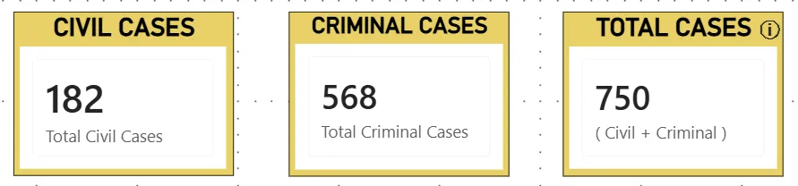
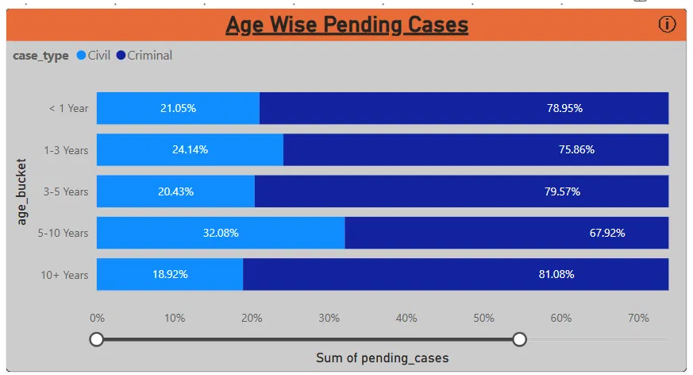
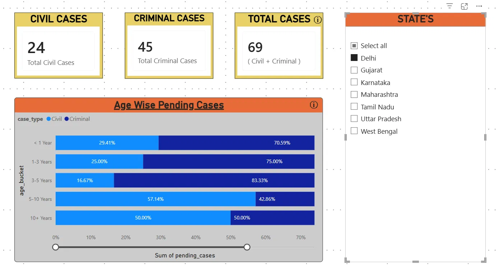

# eCourts India — End-to-End Data Engineering Pipeline

A production-grade data engineering pipeline built on Azure, modelled after the real **National Judicial Data Grid (NJDG)** — the official judicial dashboard of the Ministry of Law & Justice, Government of India.

The pipeline ingests judicial case data from a PostgreSQL source, processes it through a medallion architecture (Bronze → Silver → Gold), loads it into Azure Synapse Analytics with SCD Type 2 dimension handling, and surfaces insights in a Power BI dashboard replicating the NJDG District Courts view.

---

## Demo

▶️ YouTube [Watch Pipeline & Dashboard Demo](https://youtu.be/SIU5S5UF7dE)



---

## Architecture



| Layer | Tool | What happens |
|---|---|---|
| Source | PostgreSQL (local, 3-node cluster) | `courts` + `cases` tables, watermark CDC |
| Ingestion | Azure Data Factory | Incremental load via watermark, SHIR for on-prem connectivity |
| Landing | ADLS Gen2 | Raw CSV files, timestamped |
| Bronze | Databricks + Delta Lake | Schema enforcement, audit columns, append/overwrite by table type |
| Silver | Databricks + Delta Lake | JOIN + `age_bucket` derivation + soft delete filter |
| Gold | Databricks + Delta Lake | 3 pre-aggregated views for Power BI |
| Warehouse | Azure Synapse (Dedicated Pool) | `dim_courts` (SCD Type 2) + `fact_cases` (MERGE) |
| Reporting | Power BI Desktop | District Courts dashboard replicating NJDG |

---

## Tech Stack


---

## Dataset

Seed data modelled after real NJDG distributions — not random, not uniform.

**courts** — 50 rows (1 Supreme, 8 High Courts, 41 District Courts) with self-referencing FK encoding the 3-level Indian judiciary hierarchy.

**cases** — 1,000 rows with these real-world distributions:

| Court Level | Cases | Civil | Criminal |
|---|---|---|---|
| Supreme Court | 50 | 70% | 30% |
| High Courts | 200 | 70% | 30% |
| District Courts | 750 | 25% | 75% |

| Status | Count | % |
|---|---|---|
| Pending | 732 | 73% |
| Disposed | 268 | 27% |

| Age Bucket | % |
|---|---|
| < 1 Year | 33% |
| 1–3 Years | 25% |
| 3–5 Years | 16% |
| 5–10 Years | 16% |
| 10+ Years | 10% |

Pending probability increases with age — older cases are 85% likely still pending, newer cases 55% — matching real NJDG patterns.

---

## Pipeline Walkthrough

### 1. Ingestion — ADF (`pl_ecourts_incremental_load`)


- **cases**: Incremental load using watermark table (`last_modified` timestamp). Only changed/new rows pulled per run.
- **courts**: Full load every run — 50-row dimension table, overwrite is safe and intentional.
- SHIR (Self-Hosted Integration Runtime) bridges ADF to the on-prem PostgreSQL cluster.
- Soft deletes handled via `is_deleted` flag — no hard deletes in source.

### 2. Bronze Layer

- Raw CSV from Landing → Delta format in Bronze container.
- Schema enforced on read, no transformations.
- Audit columns added: `bronze_ingested_at`, `source_file`.
- cases: **append** mode. courts: **overwrite** mode.

### 3. Silver Layer

- `bronze/cases` JOIN `bronze/courts` on `court_id`.
- `age_bucket` derived from `filing_date` using `datediff` logic.
- `is_deleted = false` filter applied — deleted cases excluded from downstream.
- Enriched columns added: `court_name`, `court_level`, `state_name`, `bench_name`, `judge_count`, `age_bucket`, `silver_transformed_at`.

### 4. Gold Layer

Three pre-aggregated Delta tables fed into Power BI:

| Table | Aggregation | Powers |
|---|---|---|
| `gold_summary` | COUNT by court_level, case_type, status, state_name | KPI cards |
| `gold_age_distribution` | COUNT by court_level, age_bucket, case_type, state_name WHERE Pending | Age-wise bar chart |
| `gold_subtype_breakdown` | COUNT by court_level, case_subtype, case_type WHERE Pending | Case subtype table |

### 5. Synapse Layer

- **`dim_courts`** — SCD Type 2 via staging table + set-based SQL. Expires changed records (`is_current=0`, `valid_to=today`), inserts new versions. Single `INSERT` handles both changed and brand-new courts using `NOT EXISTS`.
- **`fact_cases`** — MERGE pattern via staging table. Updates existing cases in-place, inserts new ones. `is_deleted` treated as a regular column — deleted cases stay flagged, not removed.
- All operations wrapped in transactions with rollback on failure.
- No Python list collection or `.isin()` — everything set-based inside Synapse.

### 6. Power BI Dashboard

Replicates the NJDG District Courts tab at [NJDG](https://njdg.ecourts.gov.in/njdg_v3/)

- **KPI Cards**: Civil Cases (182), Criminal Cases (568), Total Cases (750)
- **Age Wise Pending Cases**: 100% stacked bar chart, Civil vs Criminal, sorted correctly via `age_bucket_sort` column
- **State Slicer**: Filters all visuals simultaneously via Many-to-Many Both-direction relationships
- **ⓘ Tooltips** on each visual for context





---

## Key Date Engineering Decisions :

** Unity Catalog** 
— 

**Watermark CDC over Debezium** — ADF-native, simpler operationally for project usecase, covers inserts/updates/soft deletes.

**Staging table + set-based SQL in Synapse** 
— Original approach used Python `.isin()` with large lists, generating `IN(...)` clauses Synapse rejects at scale. Replaced entirely with staging tables and set-based UPDATE/INSERT inside Synapse — orders of magnitude faster and scale-safe.

**SCD Type 2 on dim_courts, MERGE on fact_cases** 
— Dimension changes (judge count, bench reassignment) need history. 
— Facts don't version — they update in place(MERGE).

**Single INSERT for SCD2** 
— Changed courts and new courts handled in one `NOT EXISTS` query rather than two separate operations. Cleaner and atomic.

**Transaction safety** 
— `run_sql()` helper wraps all DML in a single transaction with `rollback()` on failure. No partial state possible.

**Gold layer registered in Databricks catalog** 
— Path-based Delta tables made discoverable to Power BI via `CREATE TABLE ... USING DELTA LOCATION` without requiring Unity Catalog migration.

**District Courts as reference implementation** 
— Real NJDG has 40+ pipeline variants. This project implements District Courts end-to-end as the reference pattern. High Court and Supreme Court follow identical logic with different case subtypes and aggregation keys.

---

## Repo Structure

```
ecourts-india-data-pipeline/
│
├── data/
│   ├── courts.csv
│   └── cases.csv
│
├── sql/
│   ├── ecourts_full_seed.sql
│   └── synapse_ddl.sql
│
├── notebooks/
│   ├── 01_bronze_ingestion.py
│   ├── 02_silver_transform.py
│   ├── 03_gold_aggregate.py
│   └── 04_synapse_load.py
│
├── adf/
│   └── pipeline_export.json
│
├── powerbi/
│   ├── ecourts_dashboard.pbix
│   └── screenshots/
│       ├── district_full_page.png
│       ├── district_kpi_cards.png
│       ├── district_age_chart.png
│       ├── district_delhi_filtered.png
│       └── powerbi_data_model.png
│
├── docs/
│   └── architecture.png
│
└── README.md
```

---

## How to Run

### Prerequisites
- PostgreSQL 14+ running locally
- Azure subscription with ADF, ADLS Gen2, Databricks, Synapse provisioned
- SHIR installed and registered to ADF
- Power BI Desktop

### Steps

1. **Seed the database**
   ```sql
   psql -U postgres -d ecourts_db -f sql/ecourts_full_seed.sql
   ```

2. **Configure Key Vault secrets**
   - `pg-password` — PostgreSQL password
   - `adls-storage-key` — ADLS Gen2 account key
   - `dbw-access-token-ecourts` — Databricks PAT

3. **Run ADF pipeline**
   - Trigger `pl_ecourts_incremental_load` manually or set 10-minute schedule trigger

4. **Verify Delta tables**
   - Check `bronze/`, `silver/`, `gold/` containers in ADLS

5. **Open Power BI**
   - Open `powerbi/ecourts_dashboard.pbix`
   - Refresh data source credentials if prompted

--
## References

- [ECOURTS Services](https://services.ecourts.gov.in/ecourtindia_v6/)
- [NJDG District Courts Dashboard](https://njdg.ecourts.gov.in/njdg_v3)
